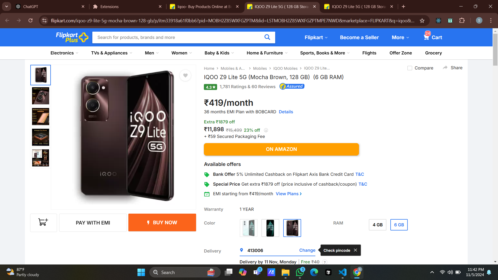
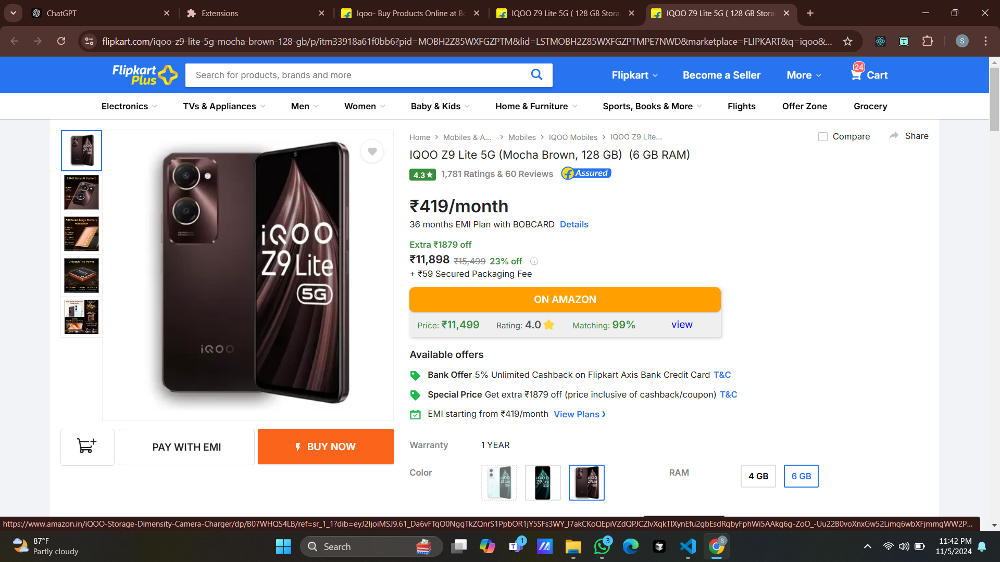
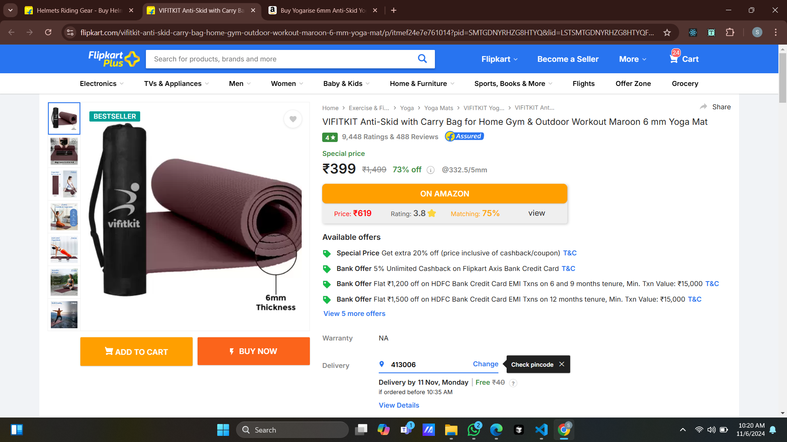
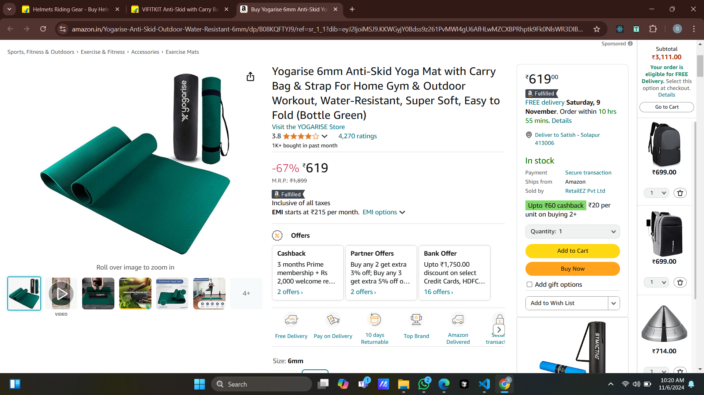

# Flipkart to Amazon Price Comparison Extension

This Chrome extension enhances your Flipkart shopping experience by displaying a product's price, rating, matching percentage, and a link to view the same product on Amazon. With this tool, users can easily compare product details between Flipkart and Amazon without switching tabs or searching manually.

## Features

- **Price Comparison**: Displays the Amazon price directly on Flipkart product pages.
- **Product Rating**: Shows Amazon product rating to provide a quick view of customer feedback.
- **Matching Percentage**: Calculates and displays the similarity percentage between Flipkart and Amazon product listings.
- **Quick Link to Amazon**: Includes a direct link to view the product on Amazon for further details.

## How It Works

1. **Navigate** to a product page on Flipkart.
2. The extension will **automatically retrieve** the relevant information from Amazon.
3. **Price, rating, and matching percentage** appear in an overlay on the Flipkart page.
4. **Click the Amazon link** to open the Amazon product page in a new tab for further comparison.

## Installation

1. Clone or download this repository.
2. Go to `chrome://extensions/` in your Chrome browser.
3. Enable **Developer mode**.
4. Click on **Load unpacked** and select the directory of this extension.
5. The extension is now ready to use on Flipkart product pages.

## Technologies Used

- **JavaScript** for DOM manipulation and API requests.
- **Puppeteer** for data extraction from Amazon.
- **CSS** for overlay styling and display adjustments.

## Future Enhancements

- Support for additional e-commerce sites (e.g., Amazon to Flipkart).
- Improved accuracy in product matching and price comparison.
- Option to track price changes over time and notify users.

## Screenshots

  
The ON AMAZON button is shown when user views a product on Flipkart.

  
When the user clicks on the button he can see the same or similar products price, rating and matching percentage of that product on Amazon.

  
Upon clicking on view the user can view the product on Amazon

  
This is another Example

  

## Contributing

Feel free to open issues or submit pull requests to improve the extension!
